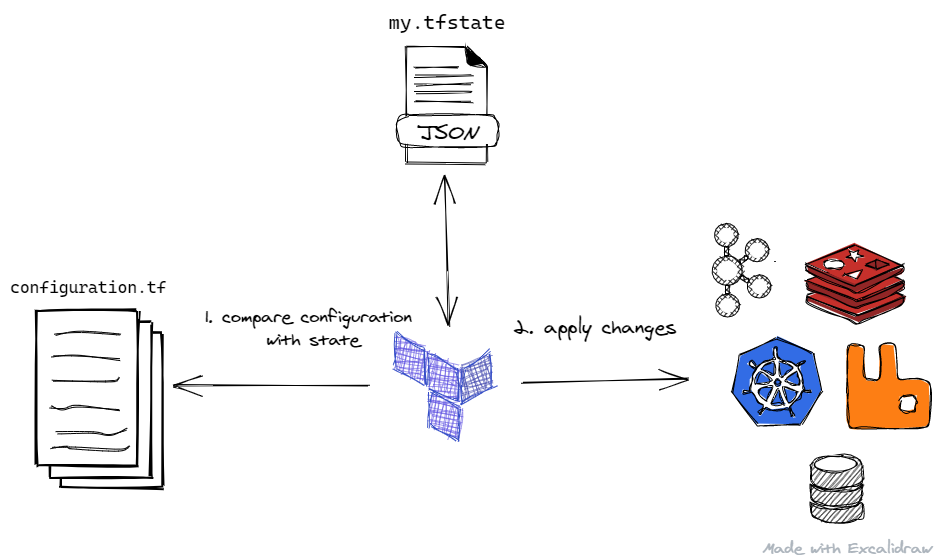

# Introduction to terraform

The goal: show main terraform commands and how to use templates from this repository

1. How to run the commands

    The repository supports [VSCode remote containers](https://code.visualstudio.com/docs/remote/containers). `.devcontainer` directory contains a ready-to-go profile and dockerfile with required dependencies to run all the samples.

    You can run all the commands:

    - on your own environment, then you have to install all the used tools (terraform, az-cli, az-func, etc)
    - inside VSCode Remote Container, then you have to install docker and VSCode extention [Remote Development](https://marketplace.visualstudio.com/items?itemName=ms-vscode-remote.vscode-remote-extensionpack).

2. What is terraform

    [Terraform](https://www.terraform.io/) is software which helps to describe *infrastructure as code* and manage it's lifecycle: plan, create, delete. If you are not familiar with terraform, after going through this demo check the complete [getting-started tutorial](https://learn.hashicorp.com/terraform).

    `terraform` transforms human-readable configuration into a state file, which applies then to external resources (e.g. Azure Cloud):

    

3. Basic commands

    0. Login to your Azure Cloud: `az login --use-device-code` and set your default subscription: `az account set -s SUBSRIPTION_ID`.

    1. Navigate to directory with terraform configuration: `cd src/terraform/02-what-is-cloud`

    2. Initialize terraform: `terraform init`

    3. Create `terraform.tfvars` file. This file contains your unique properties for the rest of terraform configuration. You can use a sample generator script: `../generate_tfvars.sh`

    4. Plan: `terraform plan`

    5. If you are happy with proposed plan, deploy the infrastructure: `terraform apply`. Browse resources in Azure portal after creation.

    6. Check terraform state file

    7. Change Storage account required TLS version and apply changes.

    Add `min_tls_version = "TLS1_2"` at line 21 in file `src/terraform/02-what-is-cloud`

    Run `terraform apply` and check the resource state at Azure Portal.

    8. Open ***Activity Log*** at Azure Portal and find your requests details there.

    9. Clean up created resources: `terraform destroy`
