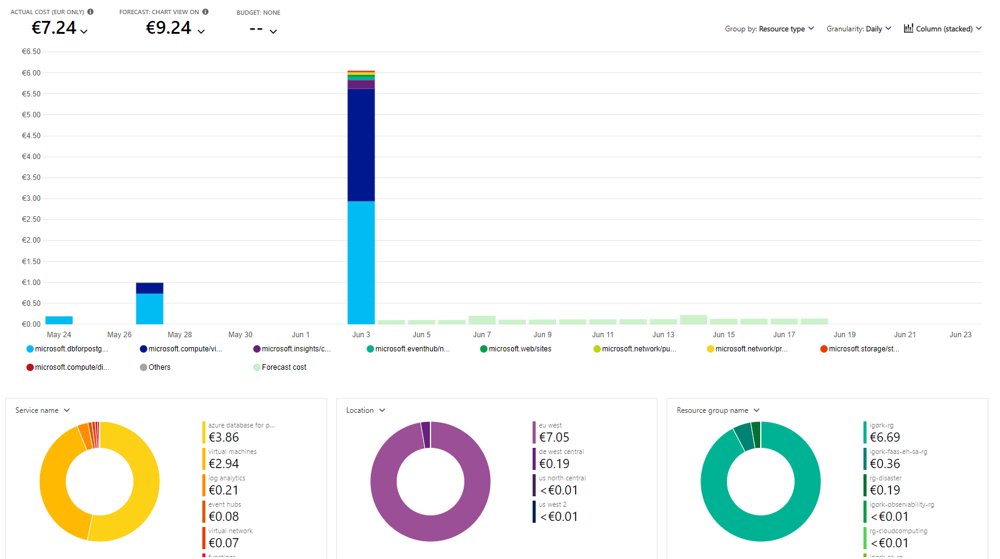
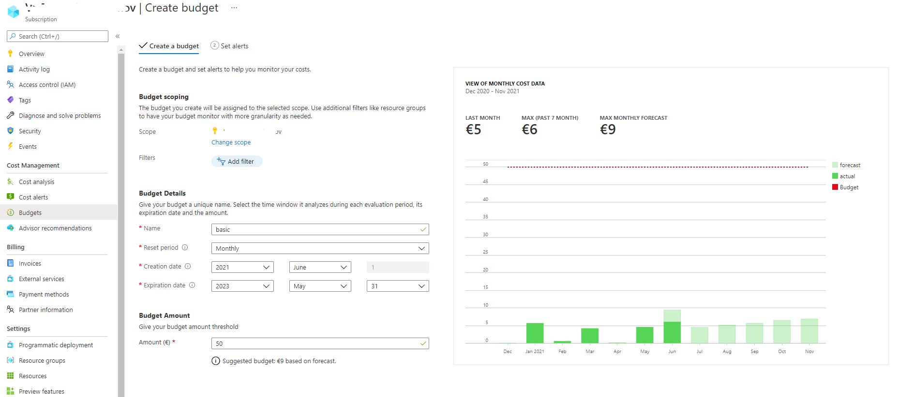

# Pricing

The goal: pricing options, cost analysis

1. Pricing is very different: there are basic compute/storage prices, but also custom units, in-advance contracts, etc

2. pay-as-you-go vs pre-paid vs spot

    Review [Azure VM](https://azure.microsoft.com/en-us/pricing/details/virtual-machines/linux/). Note, price could be different for the same resource in misc regions

3. Consumption caclulation

    - [Azure Functions](https://azure.microsoft.com/en-us/pricing/details/functions/) uses GB-s + execution count
    - [Azure CosmosDB](https://azure.microsoft.com/en-us/pricing/details/cosmos-db/) (uses custom [request-unit](https://docs.microsoft.com/en-us/azure/cosmos-db/request-units))
    - [Azure Functions](https://azure.microsoft.com/en-us/pricing/details/functions/) and [Azure SQL](https://azure.microsoft.com/en-us/pricing/details/sql-database/single/) also can use vCore/hour cpu and GB/hour RAM

4. Storage pricing

    - [Azure Storage Account](https://azure.microsoft.com/en-us/pricing/details/storage/blobs/) price changes per tier, volume, reserved
    - [Managed Disk](https://azure.microsoft.com/en-us/pricing/details/managed-disks/) has reserver prices and changes performance
    - [Azure SQL](https://azure.microsoft.com/en-us/pricing/details/sql-database/single/) and [Azure CosmosDB](https://azure.microsoft.com/en-us/pricing/details/cosmos-db/) charge for volume and backups

5. Traffic pricing

    - [Azure SQL](https://azure.microsoft.com/en-us/pricing/details/sql-database/single/), [Azure Storage Account](https://azure.microsoft.com/en-us/pricing/details/storage/blobs/), [Azure CosmosDB](https://azure.microsoft.com/en-us/pricing/details/cosmos-db/) bill for cross zone/region redundancy
    - Cloud bills for [traffic](https://azure.microsoft.com/en-us/pricing/details/bandwidth/) between zones/regions/continents, and for Internet Egress

6. Use [Azure Pricing Calculator](https://azure.microsoft.com/en-gb/pricing/calculator/) to estimate FaaS project price

    - Expect one event-emitter to produce `1 event/10 seconds`, or `8640 events/day`
    - Expect `1000` event-emitters, or `8640*1000 events/day * 30 days` or `259200000 events/month`
    - One event saved in blob takes `4 Kb`
    - Storage consumption: `8640*1000*4 Kb = 34.56 Gb/day` or `1036.8 Gb/month`
    - Function is executed twice for each events: HTTP-to-eventhub + eventhub-to-storage
    - Rough estimation for the first month:

    

    Based on the calculation most of the price goes to Storage Account writes (~1400usd), and Function consumption (~400usd). Probably, we can consider changing event-publish frequency, event-batching, reduce function execution duration

7. Cost-analysis and alerts

    - Cost-analysis helps to understand how you spent the money, for example you can group by resource-type and display daily spendings:

    

    - Create monthly budget and alerts on thresholds

    

    