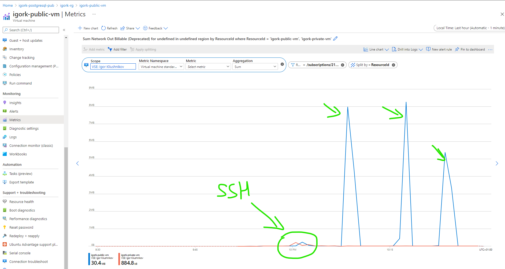

# PSQL demo

<!-- 
TODO: 
1. output public ips 
2. document ssh-key generation
-->

## Provision infrastructure

```sh
  terraform init
  terraform apply
```

## Perform tests

```sh
  ssh -i ~/.ssh/id_test adminuser@vm-ip

  sudo apt update && sudo apt upgrade -y
  sudo apt-get install -y postgresql-client postgresql-contrib

  pgbench -i "host=igork-postgresql-priv.postgres.database.azure.com port=5432 dbname=exampledb user=psqladmin@igork-postgresql-priv sslmode=require"
  pgbench -i "host=igork-postgresql-pub.postgres.database.azure.com port=5432 dbname=exampledb user=psqladmin@igork-postgresql-pub sslmode=require"

  # 3 client, 30 seconds, select-only
  pgbench "host=igork-postgresql-priv.postgres.database.azure.com port=5432 dbname=exampledb user=psqladmin@igork-postgresql-priv sslmode=require" -c 3 -T 30 -S
  pgbench "host=igork-postgresql-pub.postgres.database.azure.com port=5432 dbname=exampledb user=psqladmin@igork-postgresql-pub sslmode=require" -c 3 -T 30 -S
```

## Check results

Open Log Analytics and query:

```kusto
AzureDiagnostics 
| project TimeGenerated, Resource, Message
| where Message contains "connection received: host"
| where Message !contains "127.0.0.1"
| take 1000
```

Open any VM resource
- open `Metrics` tab
- select `Network Out Billable`
- select both VMs as scope:


